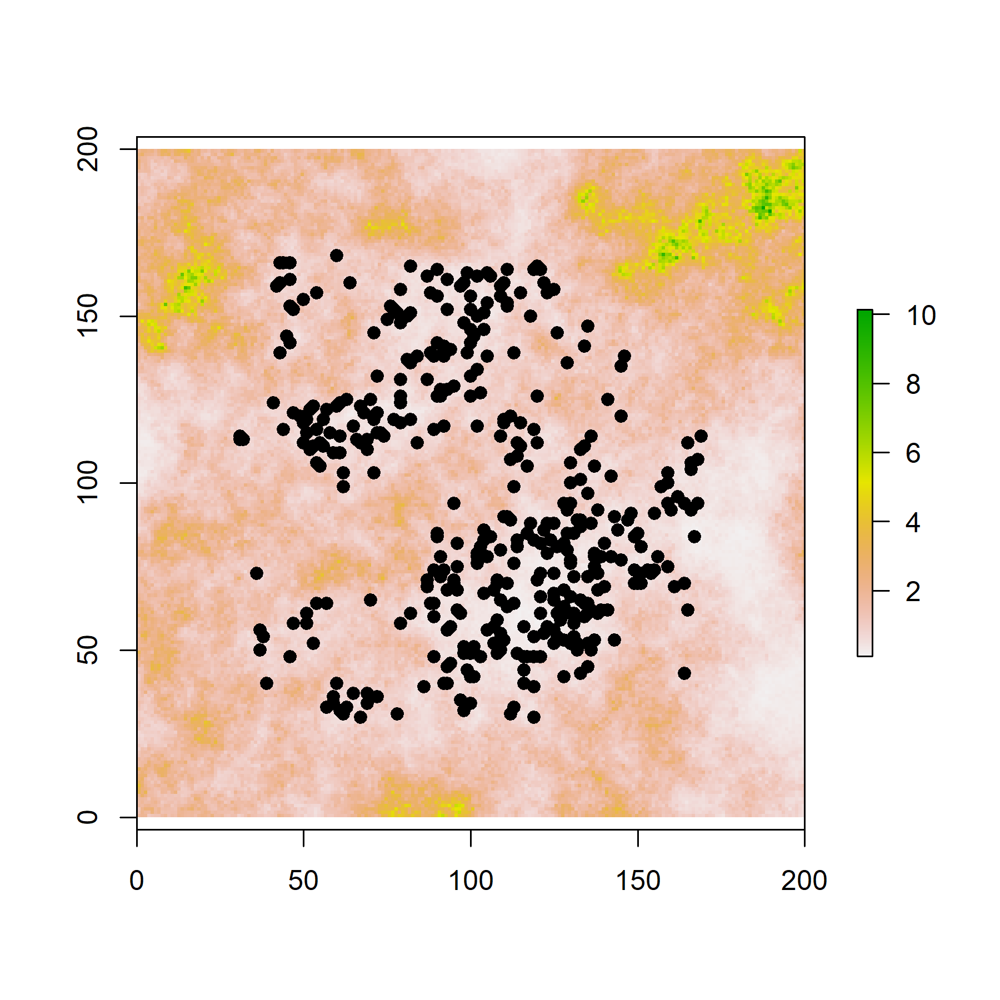
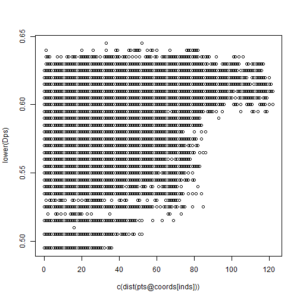
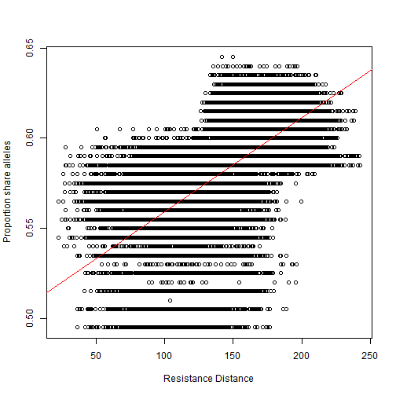
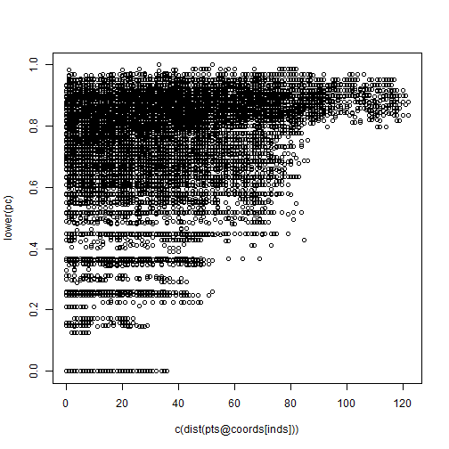
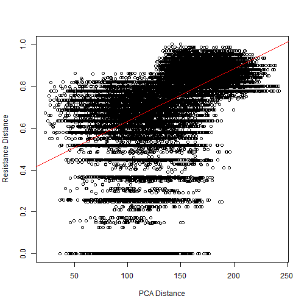

## Setting up Python

CDPOP requires Python \> v3.9. First, test to see if you have Python already installed on your computer and available. This requires the `reticulate` package, so install this if needed.


```r
#install.packages('reticulate')
library(reticulate)
py_config()
#> python:         C:/Users/peterman.73/AppData/Local/r-miniconda/envs/r-reticulate/python.exe
#> libpython:      C:/Users/peterman.73/AppData/Local/r-miniconda/envs/r-reticulate/python39.dll
#> pythonhome:     C:/Users/peterman.73/AppData/Local/r-miniconda/envs/r-reticulate
#> version:        3.9.18 | packaged by conda-forge | (main, Aug 30 2023, 03:40:31) [MSC v.1929 64 bit (AMD64)]
#> Architecture:   64bit
#> numpy:          C:/Users/peterman.73/AppData/Local/r-miniconda/envs/r-reticulate/Lib/site-packages/numpy
#> numpy_version:  1.24.3
py_available()
#> [1] TRUE
```

If Python version \> 3.19 and numpy \> 1.2, you should be good. You always need to run `py_config` when starting a new R session in order for `CDPOPr` to run.

## Simulating Data

The code below demonstrates how to simulate data using the `NLMR` package. To install this package, follow the directions [HERE](https://github.com/ropensci/NLMR) to get all necessary dependencies. While not ideal, the `CDPOPr` package and the code below rely on the 'fading' `raster` and `sp` packages. This is because resistance distance is calculated with `gdistance`, which relies on `raster` and `sp` objects.


```r
library(CDPOPr)
library(raster)
```

First, we'll define the dimensions of our raster surface, the number of points (i.e. individuals) to place on our landscape, and settings of where to place points.


```r
n_Ind <- 400    # Individuals
r_dim <- 200    # Dimension of raster
suit_hab <- 0.3 # Proportion of landscape suitable for individuals
```

With these parameters, we will now generate many more points than needed, randomly distributed across our landscape but away from the edge of the raster boundary. This will ensure that we have the requisite number (in this case 250) points left within suitable habitat. We avoid edges due to known edge effects that emerge when calculating resistance distance. Note that it is often necessary to run NLMR twice the first time in a session.


```r
## Random pt coordinates
pts <- unique(floor(cbind(runif(5000, 0.15 * r_dim, 0.85 * r_dim),
                          runif(5000, 0.15 * r_dim, 0.85 * r_dim))))
# Original raster surface
raw_rast <- NLMR::nlm_gaussianfield(r_dim,
                                    r_dim,
                                    autocorr_range = r_dim * 0.1,
                                    nug = 0.15,
                                    rescale = F,
                                    user_seed = 2580) 
# Transformed into resistance surface
resist_rast <- exp(raw_rast * 0.25)
```

Now, we determine the the quantile threshold that we want to be 'suitable' for our points. We extract values of our raster at each point, then retain only points that are less than or equal to the threshold value. Finally, we convert our final selected points to a `SpatialPoints` object.


```r
# Raster threshold value
hab_thresh <- quantile(resist_rast, suit_hab)

# Get values at points
sample_extract <- extract(resist_rast, pts)

# Filter points below threshold, reduce
sample_suit <- pts[sample_extract <= hab_thresh,]

# Create SpatialPoints object
pts <- sp::SpatialPoints(sample_suit[sample(nrow(sample_suit), n_Ind, replace = F),])
```

Take a look at what we've created.


```r
raster::plot(resist_rast)
plot(pts, add = T, pch = 19)
```


```r

```

<div class="figure">

<p class="caption">plot of chunk unnamed-chunk-7</p>
</div>

## Run CDPOP

We're now ready to run CDPOP with `CDPOPr`! The parameters specified in the function below are the main parameters that you are likely to want to adjust in your simulations. You can adjust any CDPOP parameter, but this function has been streamlined for basic simulation purposes. Make sure that your specified `sim_dir` does not have any spaces or dashes (-).


```
#> [1] "Calculating resistance distance with `gdistance`..."
#> [1] "Running CDPOP..."
```

## Genetic Data

The CDPOPr function runs CDPOP, imports the data, and formats into a `genind` object. These are stored in a list. Below, we will look at the at the last generation of the simulation. We'll read in the effective distance matrix calculated by `gdistance` using the `commuteDistance` function. This matrix was written to the specified `sim_dir`


```r
resist_mat <- read.csv('C:/Users/peterman.73/R/CDPOP/test_sim/data/resist_mat.csv',
                       header = F)

# Get the CDPOP output list
cdpop_grid <- cdpop_sim$grid_list

# Determine the last simulation
gen_get <- length(cdpop_sim$pop_list)

# Determine which individuals were present in the last generation
inds <- cdpop_sim$pop_list[[gen_get]]

# Calculation proportion of shared alleles
Dps <- 1 - adegenet::propShared(cdpop_grid[[gen_get]])

# PCA distance
pc <- pca_dist(cdpop_grid[[gen_get]], n_axes = 32)

# Plot Dps in relation to Euclidean distance
plot(lower(Dps) ~ c(dist(pts@coords[inds])))
```



```r

# Plot Dps in relation to resistance distance
plot(lower(Dps) ~ lower(resist_mat[inds,inds]),
     ylab = 'Proportion share alleles', xlab = 'Resistance Distance')
abline(lm(lower(Dps) ~ lower(resist_mat[inds,inds])), col = 'red')
```



```r

# Calculate Mantel statistic
ecodist::mantel(lower(Dps) ~ lower(resist_mat[inds,inds]))
#>    mantelr      pval1      pval2      pval3  llim.2.5% ulim.97.5% 
#>  0.6763727  0.0010000  1.0000000  0.0010000  0.6681998  0.6841556


# Plot pc in relation to Euclidean distance
plot(lower(pc) ~ c(dist(pts@coords[inds])))
```



```r

# Plot pc in relation to resistance distance
plot(lower(pc) ~ lower(resist_mat[inds,inds]),
     xlab = 'PCA Distance', ylab = 'Resistance Distance'); abline(lm(lower(pc) ~ lower(resist_mat[inds,inds])), col = 'red')
```



```r

# Calculate Mantel statistic
ecodist::mantel(lower(pc) ~ lower(resist_mat[inds,inds]))
#>    mantelr      pval1      pval2      pval3  llim.2.5% ulim.97.5% 
#>  0.6494700  0.0010000  1.0000000  0.0010000  0.6407679  0.6576144
```

## 
